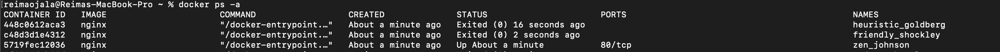
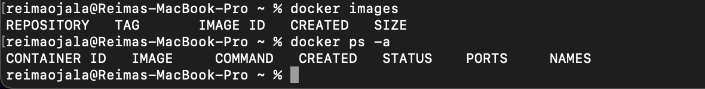
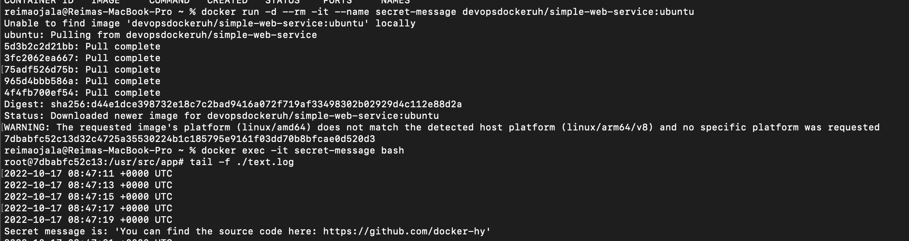
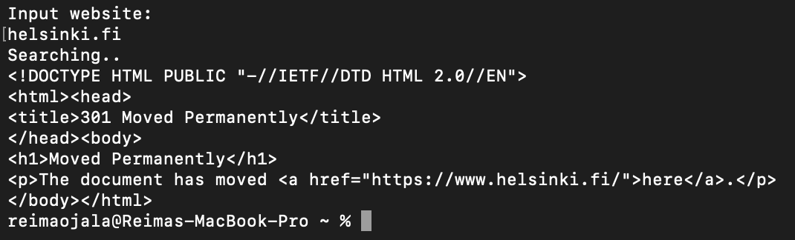
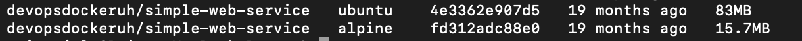
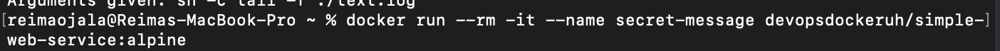
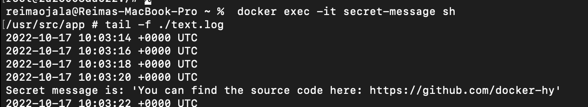
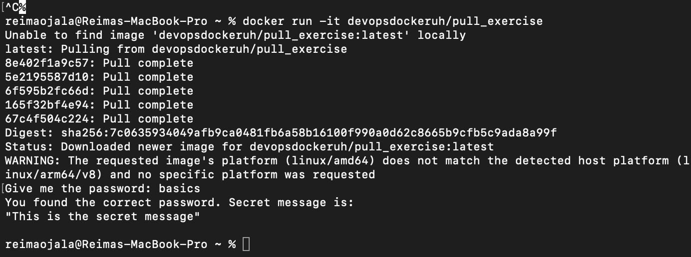
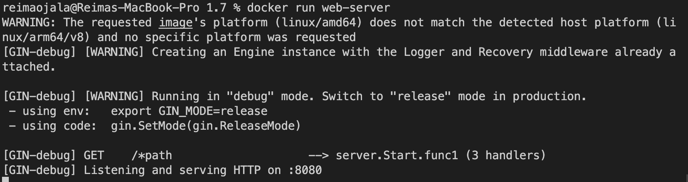
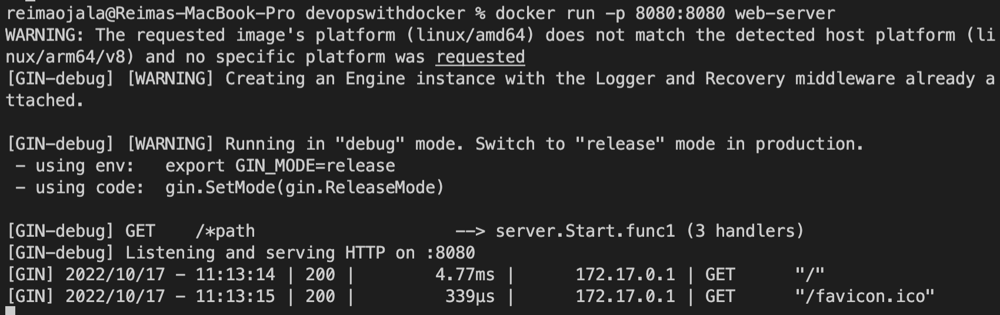

# Exercises

# Part 1

## 1.1

## 1.2

## 1.3

### commands

    docker run -d --rm --it --name secret-message devopsdockeruh/simple-web-service:ubuntu
    docker exec -it secret-message bash
    tail -f ./text.log

### img

## 1.4

### commands

    docker run --rm -it --name missing-dependencies ubuntu sh -c 'apt-get update && apt-get install curl -y;echo "Input website:"; read website; echo "Searching..."; sleep 1; curl http://$website;'

### img

## 1.5

### commands

    docker run --rm -it --name secret-message devopsdockeruh/simple-web-service:alpine
    docker exec -it secret-message sh
    tail -f ./text.log

### img

## 1.6

### commands

    docker run -it devopsdockeruh/pull_exercise
    basics

### img

## 1.7

    docker run web-server

[Dockerfile](./1.7/Dockerfile)

## 1.8

[Dockerfile](./1.8/Dockerfile)

## 1.9

### commands

    touch text.log
    docker run -v "$(pwd)/text.log:/usr/src/app/text.log" devopsdockeruh/simple-web-service

### img

## 1.10

### commands

    docker run -p 8080:8080 web-server

### img

## 1.11

[Dockerfile](./1.11/Dockerfile)

## 1.12

[Dockerfile](./1.12/Dockerfile)

## 1.13

[Dockerfile](./1.13/Dockerfile)

## 1.14

### commands

    docker run -p 8080:8080 backend
    docker run -p 5001:5000 frontend (5000 was taken)

### files

[Backend Dockerfile](./1.14/Dockerfile.backend)

[Frontend Dockerfile](./1.14/Dockerfile.frontend)

## 1.15

## 1.16

https://devopsdockercoursep.herokuapp.com/

# Part 2

## 2.1

[docker-compose.yml](./2.1/docker-compose.yml)

## 2.2

[docker-compose.yml](./2.2/docker-compose.yml)

## 2.3

[docker-compose.yml](./2.3/docker-compose.yml)

## 2.4

[docker-compose.yml](./2.4/docker-compose.yml)

## 2.5

    docker-compose up --scale compute=3
