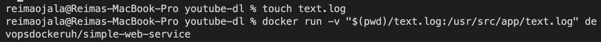

# Exercises

# Part 1

## 1.1

## 1.2

## 1.3

### commands

    docker run -d --rm --it --name secret-message devopsdockeruh/simple-web-service:ubuntu
    docker exec -it secret-message bash
    tail -f ./text.log

### img

## 1.4

### commands

    docker run --rm -it --name missing-dependencies ubuntu sh -c 'apt-get update && apt-get install curl -y;echo "Input website:"; read website; echo "Searching..."; sleep 1; curl http://$website;'

### img

## 1.5

### commands

    docker run --rm -it --name secret-message devopsdockeruh/simple-web-service:alpine
    docker exec -it secret-message sh
    tail -f ./text.log

### img

## 1.6

### commands

    docker run -it devopsdockeruh/pull_exercise
    basics

### img

## 1.7

    docker run web-server

[Dockerfile](./1.7/Dockerfile)

## 1.8

[Dockerfile](./1.8/Dockerfile)

## 1.9

### commands

    touch text.log
    docker run -v "$(pwd)/text.log:/usr/src/app/text.log" devopsdockeruh/simple-web-service

### img

## 1.10

### commands

    docker run -p 8080:8080 web-server

### img

## 1.11

[Dockerfile](./1.11/Dockerfile)

## 1.12

[Dockerfile](./1.12/Dockerfile)

## 1.13

[Dockerfile](./1.13/Dockerfile)

## 1.14

### commands

    docker run -p 8080:8080 backend
    docker run -p 5001:5000 frontend (5000 was taken)

### files

[Backend Dockerfile](./1.14/Dockerfile.backend)

[Frontend Dockerfile](./1.14/Dockerfile.frontend)

## 1.15

Skipped for now

## 1.16

https://devopsdockercoursep.herokuapp.com/

# Part 2

## 2.1

[docker-compose.yml](./2.1/docker-compose.yml)

## 2.2

[docker-compose.yml](./2.2/docker-compose.yml)

## 2.3

[docker-compose.yml](./2.3/docker-compose.yml)

## 2.4

[docker-compose.yml](./2.4/docker-compose.yml)

## 2.5

    docker-compose up --scale compute=3

## 2.6

[docker-compose.yml](./2.6/docker-compose.yml)

## 2.7

Skipped because of problems with Apple M1 Chip

## 2.8

[docker-compose.yml](./2.8/docker-compose.yml)
[nginx.conf](./2.8/nginx.conf)

## 2.9

[docker-compose.yml](./2.9/docker-compose.yml)

## 2.10

Removed hardcoded env variables from Dockerfiles and pass them from docker-compose.yml instead, no ports needed since we are using the reverse proxy

[docker-compose.yml](./2.10/docker-compose.yml)
[backend dockerfile](./2.10/Dockerfile.backend)
[frontend dockerfile](./2.10/Dockerfile.frontend)

## 2.11

Skipped for now

# Part 3

## 3.1

https://github.com/ReimaWM/coursepage/blob/master/.github/workflows/heroku.yml

## 3.2

[Files](./3.2/)

## 3.3

Basically just added the useradd and USER commands, no permission errors showed up

[Files](./3.3/)

## 3.4

Backend went from 934 MB to 22.9 MB, since i changed from running the build in the golang image to building it there and copying it to alpine image.

Frontend stayed pretty much the same, did some optimizations, but no real effects since it was already node alpine image. Could have hosted the build with something like nginx:alpine instead of serve to make some real size reduction.

[Files](./3.4/)

## 3.5

For frontend, i was already using lts-alpine with image size of 445 MB, if i switch the base image to just lts, the size goes to 1.19 GB

Backend was using golang:1.16.15 before 3.4 optimizations with size of 934 MB, with alpine version of golang, it goes down to 440 MB

## 3.6

Did the frontend hosting with nginx alpine image, reducing the image size to 22.4 MB

Backend was basically already setup as multistage, but changed the hosting to use scratch instead of alpine as requested, reducing the final image size to 17.1 MB

[Files](./3.6/)

## 3.7

skipped

## 3.8

Did some basic diagram, not really related to any real service

